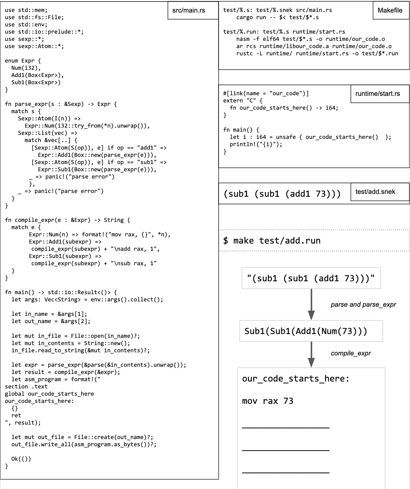

# One-page compiler, Rust edition

Joe Gibbs Politz posted the above [one page compiler](https://twitter.com/joepolitz/status/1643018560523091970) written in Rust on
Twitter. I transcribed the code and added a `Cargo.toml` file so you can
compile it.

You need `cargo` and `rustc` installed, it expects to compile and run on
an x86_64 machine running linux.
